# NanoProm v0.1 beta
Original Xbox and standalone EEPROM flasher for Arduino Nano / Pro Micro / ..and likely more Arduino variants

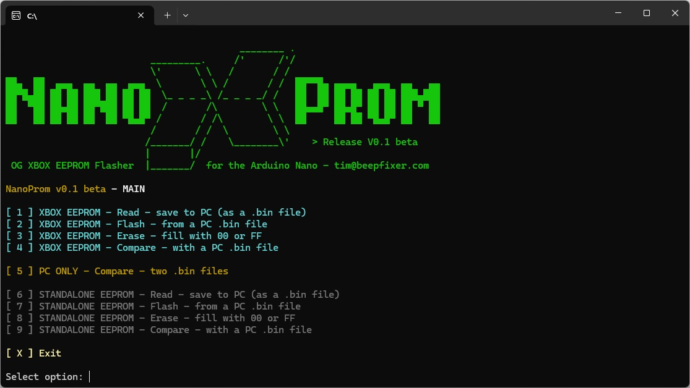

## Overview & Features

NanoProm is heavily inspired by <a href="https://github.com/Ryzee119/ArduinoProm">Ryzee119’s ArduinoProm</a>, which in turn owes its roots to <a href="https://github.com/grimdoomer/PiPROM">Grimdoomer’s PiPROM</a>.

After two days of trying to breathe life into my CH340-based USB-C Nano clone (MEGA328PB), which stubbornly refused to cooperate, I purchased a Micro variant (MEGA32U4) and - bam - that worked perfectly using Ryzee119’s ArduinoProm.

That could have been the end of it, since I just needed something to replace my last dying Windows 98 laptop with a serial port - but with so much time lost and stubbornness being my middle name.. I figured, why not make a fun project to see if a bit of AI magic could help me learn C++ and Python enough to understand what’s going on? Maybe then I could even tinker the Nano to work after all.

The result - after plenty of crying and cursing - is **NanoProm v0.1 beta**!

NanoProm works on the same principles as its predecessors but presents the functionality in a **menu style** and includes a few tricks that I hope will simplify life for Xbox enthusiasts and **reduce the confusion** around using text prompts, especially for new generations who did not grow up with prompts as the norm.  

I truly hope this reaches Xbox fans who appreciate the healthy, huge dose of **“NO WE WON’T” stubbornness** I put into it - grin - and at the end of the day, just learning a bit of C++ and Python in the process made the time spent worthwhile. If NanoProm ends up rescuing even a single Xbox from the scrapheap, that is already a big bonus in my eyes.  

Below you'll find detailed information on how to connect and use NanoProm. I’ve included as much detail and screenshots as possible, so the amount of time needed to explain this on awesome user-friendly sites like [Reddit /r/originalxbox](https://www.reddit.com/r/originalxbox/) or [OGXbox Forums](https://www.ogxbox.com/forums/) is minimized.

**In closing**
I have been tinkering with Xbox hardware for nearly 25 years, worked on thousands of units, and this is finally my first hardware/software contribution to the Xbox scene.  

If you're reading this - please take a second to appreciate how incredibly friendly and helpful Xbox sceners are to others and newcomers - I have met a huge number of amazing people, directly and indirectly involved in the Xbox scene, both in person and online -and- I am truly proud to be part of it!

If you run into any issues, feel free to drop me a DM on Reddit or OGXbox - enjoy!

**Tim** aka **BeepFixer**

---

## So.. What Can NanoProm Do?

* Read, write, and erase your <strong>Original Xbox onboard EEPROM</strong> without removing it.
* Read, write, and erase a <strong>standalone EEPROM (24c02)</strong> via chip legs or an adapter.
* Backup to your PC/Laptop as a <code>.bin</code> file.
* Flash the EEPROM with a new <code>.bin</code> file.
* Compare <code>.bin</code> files against the chip or other <code>.bin</code> files.
* Erase the EEPROM with <code>00</code> or <code>FF</code>.

> ⚠️ <strong>Warning:</strong> Use NanoProm at your own risk!
>
> It has some safety checks, but it cannot fix everything. Be careful not to short the Xbox or the board, and watch your hands!

# Wiring Guide

Below are the pinout diagrams used in this setup. 

All diagrams are colour-coded in each picture, to help you match the correct pin connections between components.

* Orange (SCL)
* Blue (SDA)
* Black (GND)
* Red (3.3v/5v) <- only used when connection a 24c02 outside of the Xbox

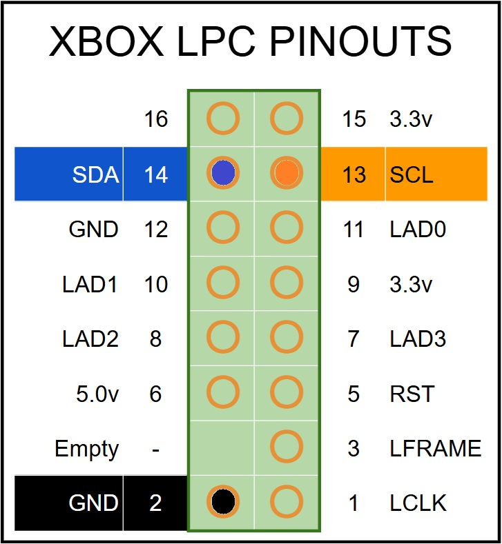
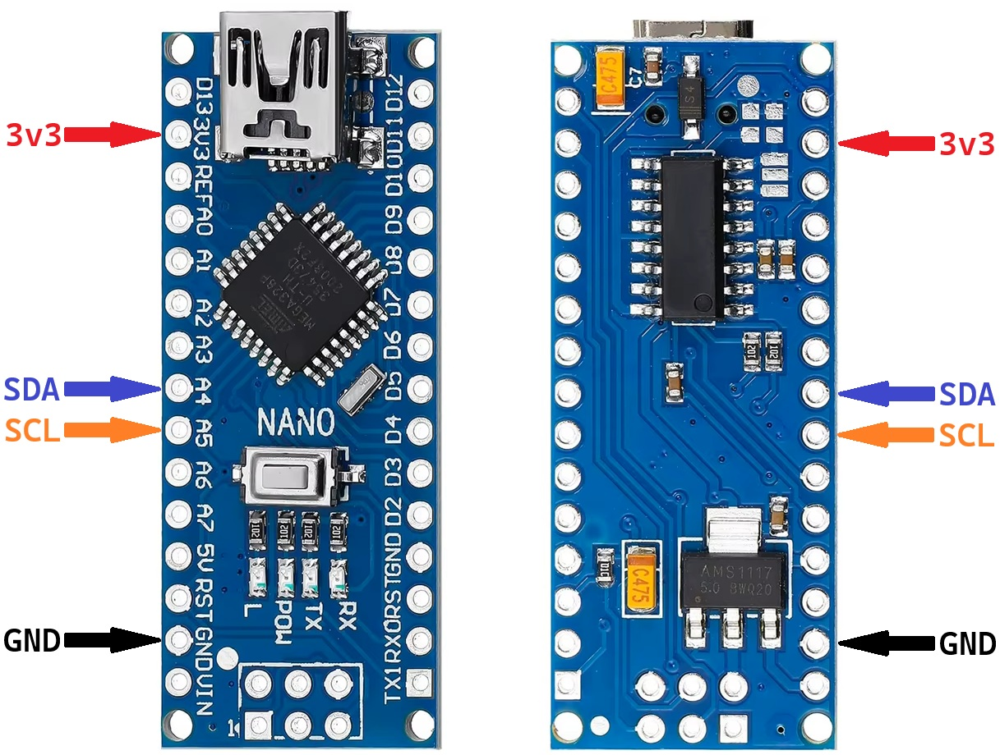
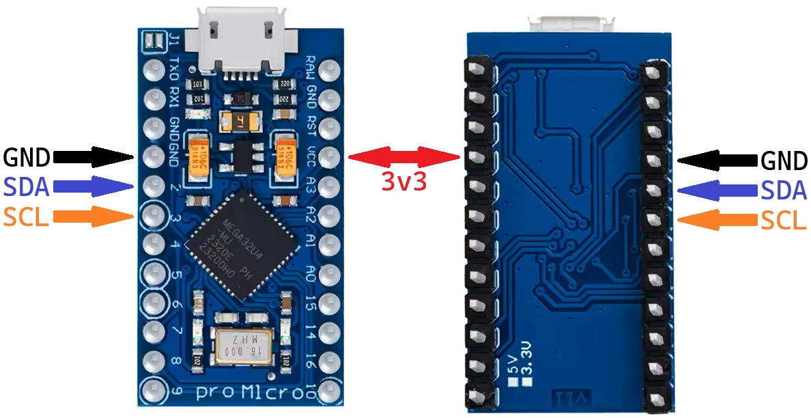
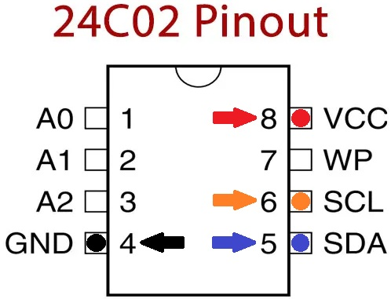
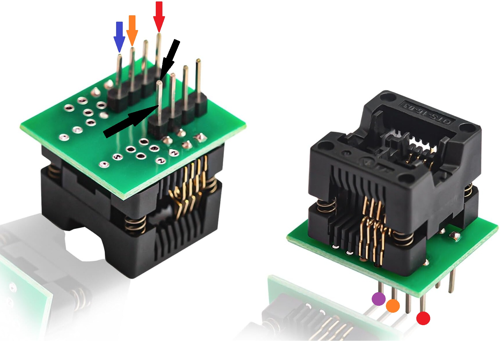

---

### >> IMPORTANT <<

Do **NOT** connect the **RED WIRE** when wiring directly to the Xbox!

The red wire (3.3V/5V) is only required when powering the EEPROM externally, and should be left disconnected when using the Xbox as the power source!

Likewise, ensure that neither the Arduino board nor its pins (depending on the type used) come into contact with the Xbox mainboard surface or casing (GND), as this may cause a short circuit to the Xbox or the board!

If you are eager to get started but are not used to working on open electronics, or simply want an extra layer of safety, consider using wide electrical tape to cover the Nano and its connections so they cannot come into contact with any components on the Xbox mainboard.

---

## External EEPROM Connections

The Red wire (3.3V/5V) must be connected when working with the EEPROM outside of the Xbox, for example:

- Directly wiring to a 24C02 chip  
- Using a SOIC8-to-DIP8 adapter  

Where possible, always perform actions on the EEPROM while it is attached to the Xbox mainboard!

However, if you have NO other choice and must remove it, take care when removing or replacing a 24c02.

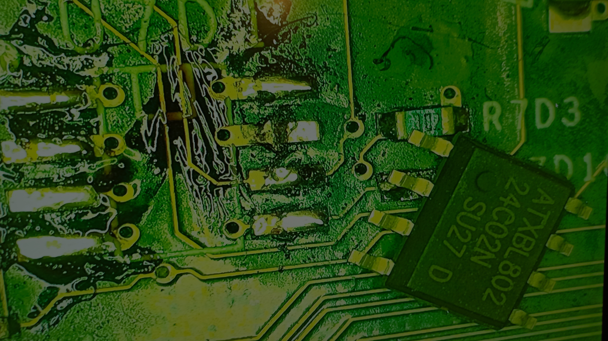

Do NOT (!) pull on the chip while heating its solder connections - it should lift off smoothly. Pulling the chip while any of its 8 legs are still attached can damage or lift/snap traces on the mainboard. While this can be repaired with the right tools, it is not a beginner-level job, so please be careful.

While I encourage people new to soldering to learn tasks such as capacitor removal or even TSOP modding, I would not consider replacing the 24c02 a beginner-level job. If you must attempt it, please practice first on scrap electronics using a chip of similar size.

Keep in mind the 24c02 removed from the Xbox mainboard needs to receive the 3.3v/5v connection from your Arduino (red), and you use menu options 6 to 9 in NanoProm.

## Voltage Notes

The 24C02 EEPROM supports a supply voltage between **1.8V and 5.5V**.

Depending on the board used, you can supply either 3.3V or 5V from the board.

## Wires
I use pin headers on the Xbox, both boards, and the SOIC8 to DIP8 adapter, together with 10 cm female-to-female Dupont wires that connect to the male headers, as shown in these photos.

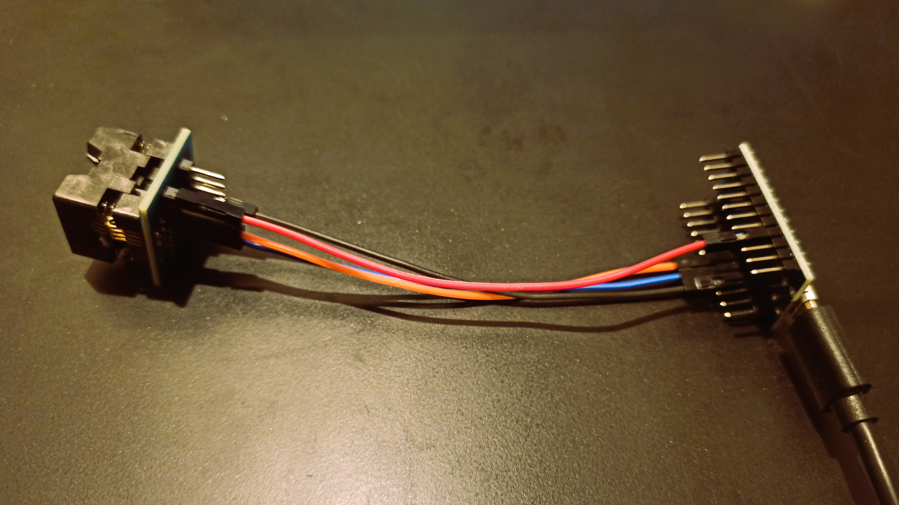

However, this specific method of using pinheaders and dupont cables is not critical - the connections themselves are what matter. 

You can also solder wires directly from your Arduino board directly to the LPC if preferred.

Just make sure to keep the wires relatively short, as longer wires increase the chance of connection issues or failure.

---

# Arduino Setup

Firstly, I want to emphasize that I started writing NanoProm's firmware because I was completely stuck trying to get my Nano clone to work with Ryzee119’s ArduinoProm.  

NanoProm is essentially the result of me:  
* Initially not fully understanding Arduino IDE  
* Being stuck with a CH340 clone board  
* A lot of trial and error  
* Being stubborn  

I also want to emphasize that I greatly appreciate what Ryzee119 created! If I had not started with a clone board, I likely would never have gone down the route of building something myself.  

Also, this is literally my first attempt at both C++ and Python, and - yes - I needed plenty of help from ChatGPT, along with a lot of testing and re-testing to get it working (not to mention, as usual, fixing the dozens of mistakes ChatGPT inevitably makes). By that point, I started adding small helper features and quality-of-life improvements, which eventually evolved into the menu-driven approach and now NanoProm.

In the end, it very much falls into the category of "it works on my computer" and "it works with the specific two clones I have in my hand".

I was actually expecting to fall back to ArduinoProm for the Pro Micro, but NanoProm ended up working very nicely on both boards, which hopefully means it will also work with whatever Arduino (clone) you are using.

For reference, **the Nano** I used was sold as:
_"Nano 3.0 Mini Type-C USB With the bootloader compatible Nano controller for Arduino CH340 USB driver 16MHz ATMEGA328PB"_

The **Pro Micro** I used was sold as:
_"Pro Micro ATmega32U4 5V 16MHz Replace ATmega328 For Arduino TYPE-C With 2 Row Pin Header for Leonardo Mini USB Interface Pro"_

I am not linking to specific AliExpress listings, as Arduino clone listings on AliExpress or eBay tend to appear and disappear frequently. The descriptions above are provided so you know exactly what was tested, but even if I were to purchase the same item again, there is a high chance of receiving a different variant.

One identifier you can use is the Atmel chip on the board, such as the Pro Micro variant (MEGA32U4 / Leonardo) or the Nano variant (MEGA328PB / CH340-based). However, this is still hit and miss, as product photos often do not match what you actually receive.

The good news is that you can likely just go for the cheapest option - in my case both were under 2 euro, so you will not break the bank being stubborn haha.

---

## Software Setup: CH340 Driver (Nano specific)

Check your computer's Device Manager and see if your Nano clone appears correctly under "Ports (COM & LPT)". 

In many cases, it will not show up properly by default, and you will need to install the appropriate drivers!

If you do not see it listed, as shown in the image below:

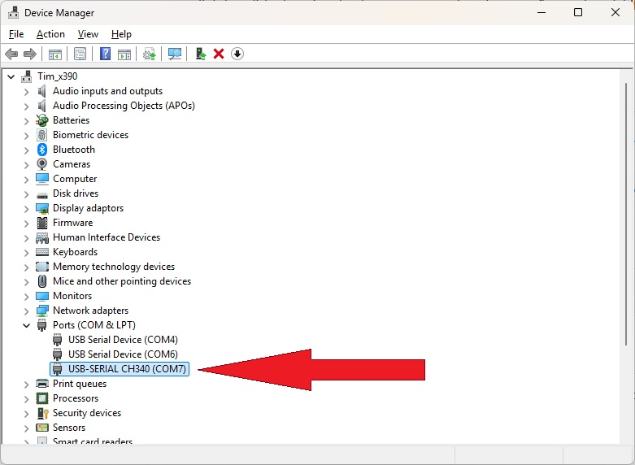

You will most likely need to install the CH340 driver for your Nano clone. 

This can be downloaded from WCH's official English website: https://wch-ic.com/downloads/CH341SER_ZIP.html -> **CH341SER.EXE**

Once you’ve installed the driver, check Device Manager again - your board should now be recognized and assigned a COM port.

## Software Setup: Arduino IDE

**Important:** Any `.ino` file, including `NanoProm.ino`, must be in a folder of the same name because the Arduino IDE treats the folder as the project container (sketch) rather than just the file itself.  

That’s why the structure of NanoProm is organized as follows:

* `NanoProm` (folder)  
  * `NanoProm.ino` (file)  
  * `binfiles` (folder where EEPROM data and reports are saved/loaded)  
  * `python` (folder containing `NanoProm.py` to start the tool)

While semi on the topic also note that in NanoProm you can use the prompt to save or load files in any location on your computer, for example `C:\eeprom.bin`. Just keep in mind that the tool’s default folder is `binfiles`, so if you want to load or write elsewhere, you will need to provide the full path. Always double-check the path to avoid overwriting important files.

**Back to setting up Arduino IDE:**

Once your board is recognized in Device Manager, you will need to install **Arduino IDE** to compile and upload the firmware to your board.

Download the latest version from here: https://www.arduino.cc/en/software/ (I am currently using 2.3.8).

1. Open `NanoProm.ino` in Arduino IDE
2. Select the right board
3. Select the right COM port
4. Verify 
5. Program

## Selecting the Right Board

First, make sure the correct board is selected from the Arduino IDE's list of available boards.  

Example for the **Pro Micro** variant (MEGA32U4 / Leonardo):  
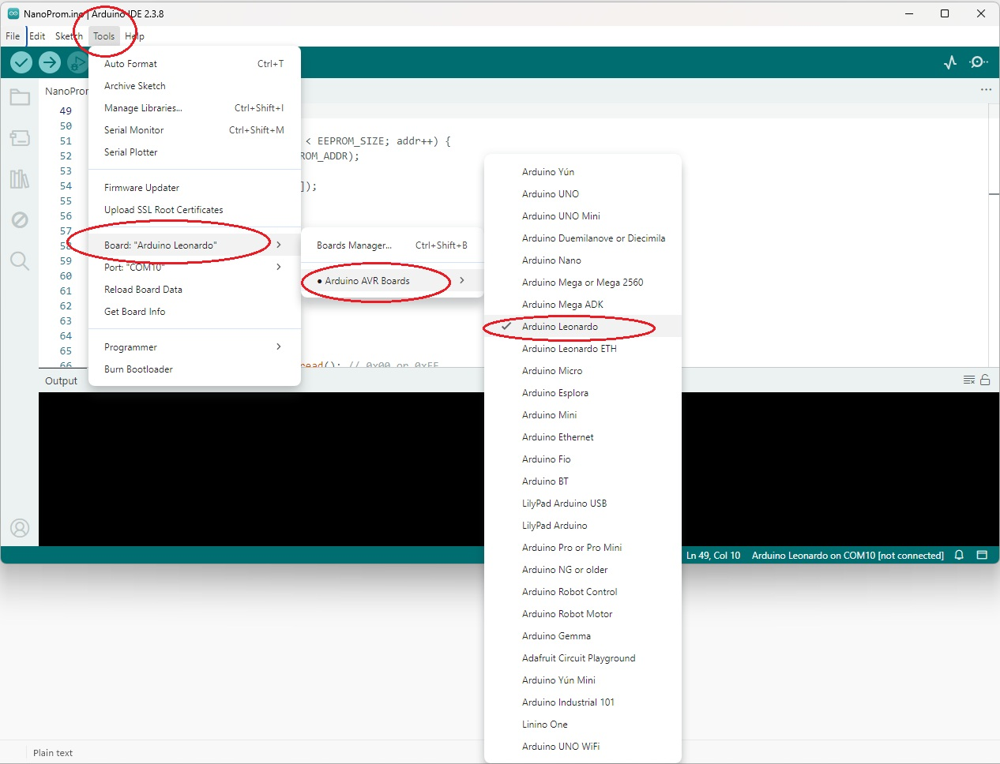

Example for the **Nano** variant (MEGA328PB / CH340-Based):  
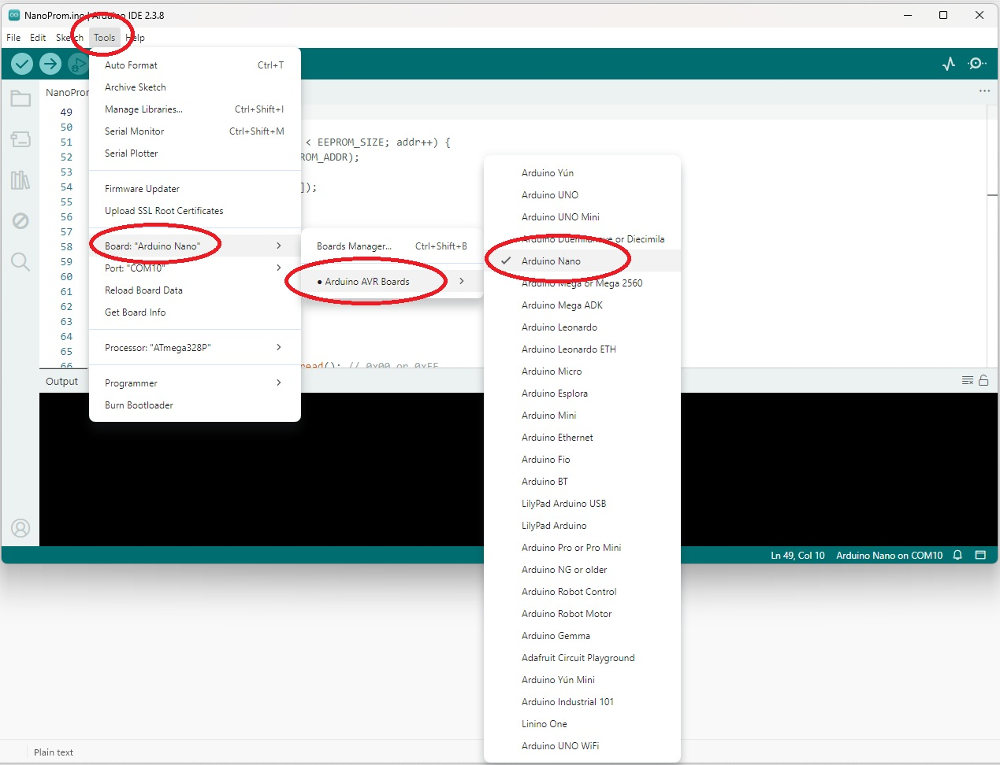

---

## Selecting the Right COM Port

Next, make sure the correct COM port is assigned.  

Check Windows Device Manager to see the assigned ports. 

Please note that the COM port can change in Windows depending on which USB port you use. In NanoProm, the available ports are listed for you, but when setting up the Arduino IDE, make sure to check Windows Device Manager, as shown in the two examples below.

**Pro Micro (MEGA32U4 / Leonardo)**:  
Device Manager view:  
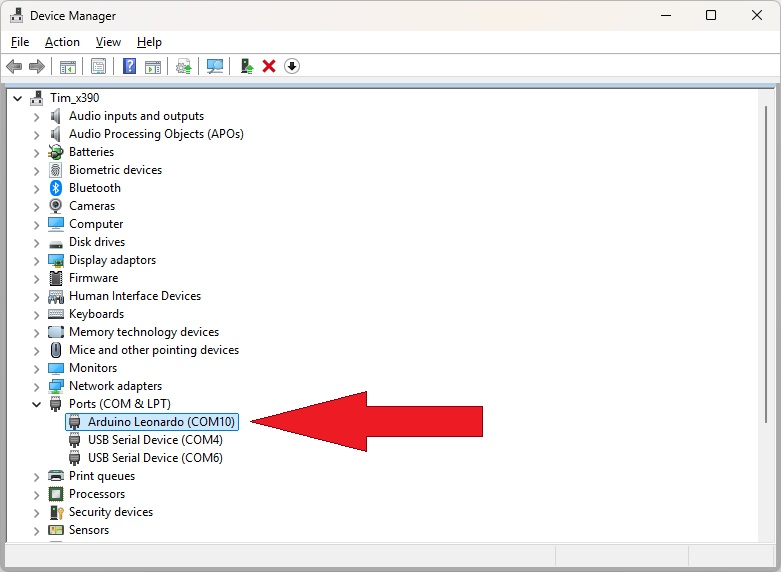  

COM port selection in Arduino IDE:  
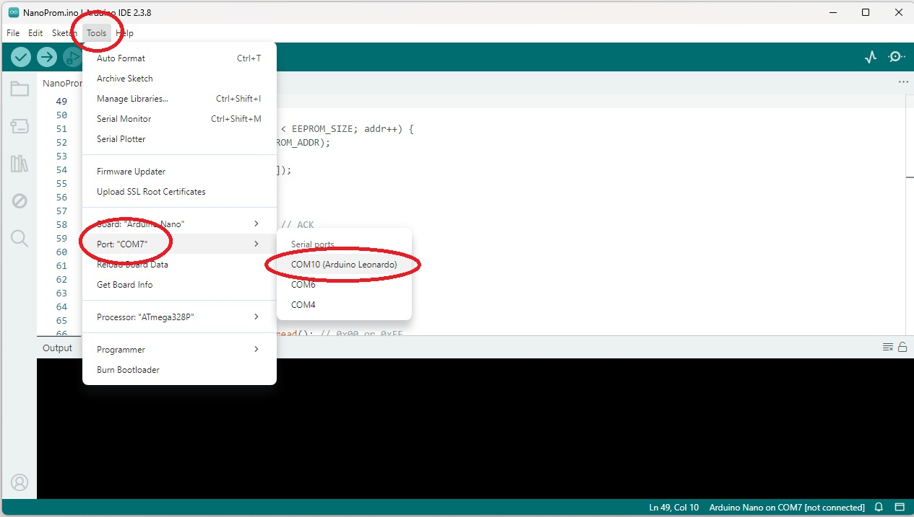

**Nano (MEGA328PB / CH340-Based)**:  
Device Manager view:  
  

COM port selection in Arduino IDE:  
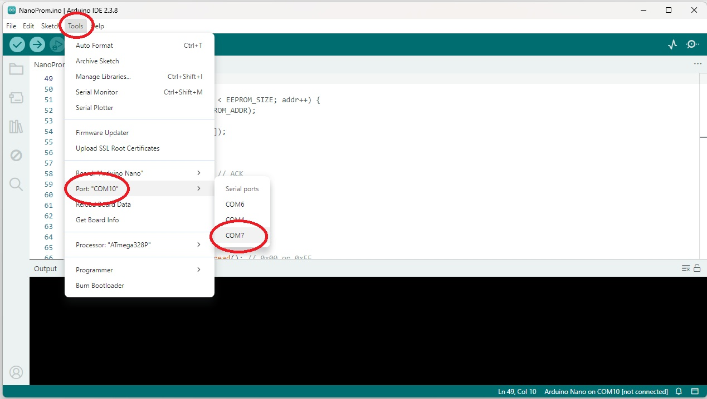

---

## Final Check in Arduino IDE

Once you have assigned the correct board and COM port, the bottom right of the Arduino IDE window should show the selected board and port.  

**Pro Micro (MEGA32U4 / Leonardo)**:  
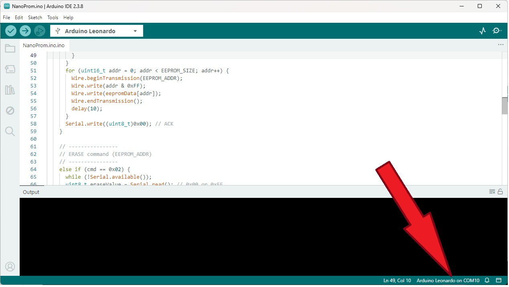

**Nano (MEGA328PB / CH340-Based)**:  
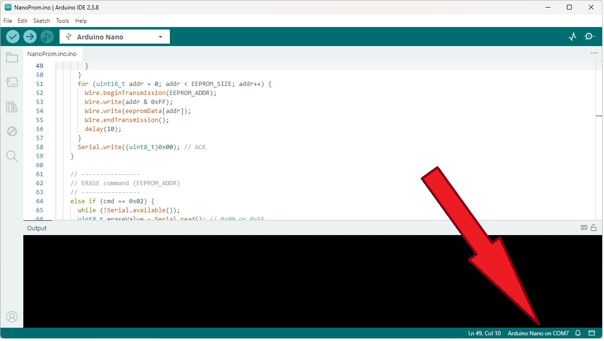

---

## Program the Firmware

Last but not least, hit the **Upload** button in Arduino IDE to write the firmware to your board. 

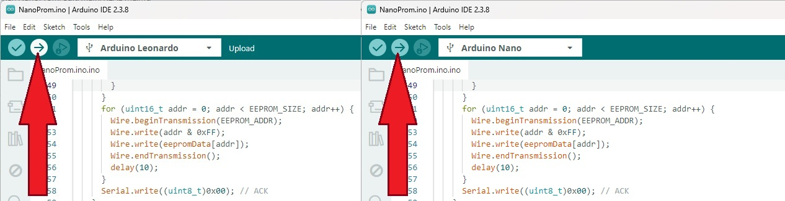

You'll need to wait a few seconds. You may hear the typical USB connect/disconnect sounds, and once the upload finishes, you should see a message like this:

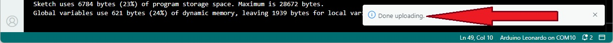

At this point, the firmware is successfully on your board. From here, we will use a Python script with a menu of options (explained in the next section) to read, write, or compare the EEPROM.

---

## NanoProm is Menu Driven and Uses Python

NanoProm is controlled via a Python script that runs a menu, making interaction with the Arduino board simpler and more user-friendly. It also performs a few automatic checks along the way.

Although it’s not a full Windows GUI with pop-up menus, usage is straightforward:
- read the options on the screen
- choose the corresponding number or letter
- and hit Enter.

The interface is simple and lean, with helpful features such as:

- COM port selection from available ports  
- Error report saving (press Enter to auto-generate a timestamped filename)  
- Visual red and green indicators when comparing binaries  
- Built-in verification steps where possible  

---

## Installing Python

To use NanoProm, you will need to install Python, which can be downloaded here: https://www.python.org/downloads/

After installing Python:

1. Open a Command Prompt (type `CMD` in the Windows search bar).  
2. Install the required packages by typing:

<code>pip install pyserial</code>

<code>pip install wxPython</code>

You can safely run these commands again if you’re unsure whether they were already installed - Python will simply let you know that the packages are already present.

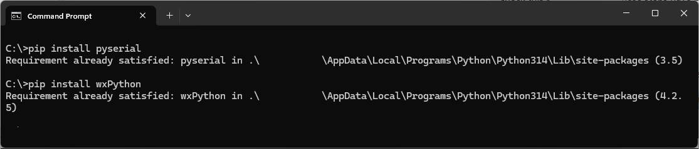

After completing these steps, you can simply double-click the `NanoProm.py` file to start the main menu each time you want to use NanoProm.

---

## A Quick Look Into the Menu

The important thing to know is that NanoProm can be used for 2 types of connections.

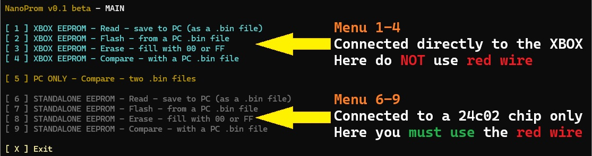

**1. Direct to Xbox**  
This is where you use the Orange (SCL), Blue (SDA), and Black (GND) wires.  
The Red (3.3v/5v) is **NOT** used since the Xbox will power the EEPROM.  
Remove the DVD and hard disk, then boot the Xbox before reading or writing to the EEPROM.
The Xbox will be flashing Green/Orange in the front ring - if it doesn't, or if it shuts down after short attempts, your wiring might be wrong - check it and try again - it should be flashing Green/Orange and remain powered on constantly.

> Menu options 1 to 4 are specifically for the Xbox variant

**2. Connected to Only an EEPROM Chip (24c02)**  
The EEPROM is pretty sturdy, but there are occasions where you might need to read and write directly to a 24c02 chip. This could be because the original chip has failed and needs replacing, or because the mainboard or power supply has died and you just want to read the EEPROM.  
In this case, use the Orange (SCL), Blue (SDA), Black (GND), and Red (3.3v/5v) wires.

> Menu options 6 to 9 are specifically for the solo 24c02 variant

In both cases, the actions are identical. The only difference is that a standalone 24c02 uses address (0x50), while inside the Xbox it uses address (0x54).

For anyone looking into the code, you will notice the two paths are fairly separate. This is because, while trying to optimize the code, I ran into limitations with my experience in C++, Python, and serial timing. After several failed attempts at merging things cleanly, I chose to keep separate read/write paths. As a user, you will not notice any difference - this is just mentioned in case someone wants to tinker with the code.

## Menu Driver COM Port Selection

Rather than having to type the port in command prompts, NanoProm simply asks you which port to use for each action, whether it is reading, writing, erasing, or comparing.

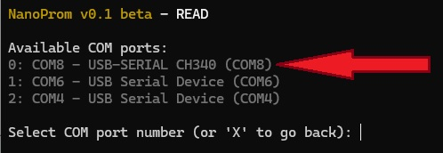

It displays a list of available COM ports, which may differ per computer. For example, my laptop always shows ports 4 and 6, even with or without a board attached. The port your board appears on may also change depending on which USB port you use.

You will always be able to identify it easily, as the menu shows the exact same name as Windows Device Manager. In the screenshot above, you would type `0` and press Enter to select the board on port 8.

The next time you run NanoProm, this might appear as port 7, or as menu option 1 or 2. It can change, so just select the correct one shown during your session. Even if the port differs from the one used in Arduino IDE, it does not matter - the board is already flashed. You only need to select the port currently used to communicate with it.

## Remember to Power On (when using the Xbox method)

The most common error you will run into is forgetting to power on your Xbox so the EEPROM receives the voltage needed to communicate. For example:

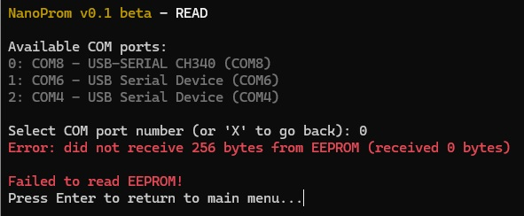

You will most likely be using options 1 to 4. In that case, remove the DVD drive and hard disk, then power on the Xbox before performing any actions. The video cable does not need to be connected.

**Note:** Do not keep the Xbox powered on for too long - only turn it on when needed for your actions. Also, turning it off requires holding the power button for a couple of seconds.

**Note 2:** Do not forget to have your USB cable from the computer to the Arduino connected, as well as the wires from the Arduino to the Xbox, before you turn on the Xbox. Powering on the Xbox without the USB connected (while the Arduino is connected) may cause booting problems. Also, do not connect the USB cable to your computer while the Xbox is powered on - always power down the Xbox first.

P.S. When wired directly to a 24C02 (or using a SOIC8-to-DIP8 adapter), this doesn’t apply - power comes from the red cable.

## Read Example

Since all actions are identical whether connected to the Xbox or only the 24c02 chip, all examples of reading, writing, erasing, and comparing apply to both.

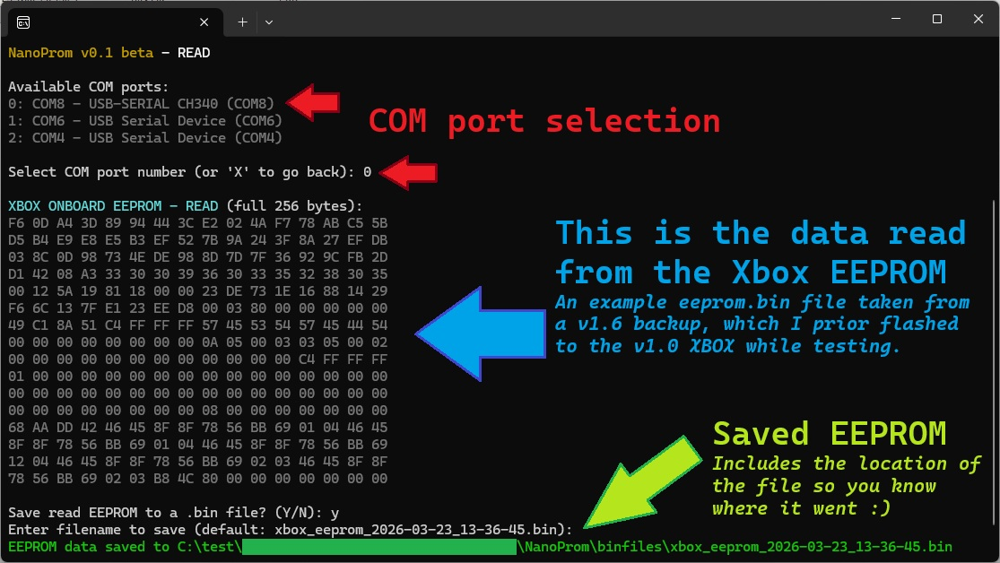

In this example, I selected the COM port in the red arrow section and read the EEPROM currently on my v1.0 mainboard. In this case, it is a random EEPROM backup from a v1.6 mainboard, which I previously flashed to my v1.0 testing Xbox.

The blue arrow section shows that each time you read an EEPROM, the data is displayed on screen exactly as it is read from the chip.

Next, you will be asked if you want to save the data as a file on your computer.

Note: If you simply press Enter (rather than providing a name and or location manually), the file will be saved using a timestamp in the filename, for example "xbox_eeprom_2026-03-23_13-36-45.bin".

If you do not specify a target directory, the file will be saved in the `binfiles` directory. However, in the green arrow section, you will always be able to see exactly where NanoProm saved the file on your computer.

## Flashing / Writing a .bin File to EEPROM

When using the write function of NanoProm, a small progress bar shows the flashing process. It goes without saying that you should **not** turn off the power to the Arduino board or the Xbox during this process. That said, unlike when flashing a computer BIOS, NanoProm will very likely still be able to re-flash the chip, since a fully operational Xbox is not required — only the power supply and power circuit on the mainboard are needed to execute a new flash.

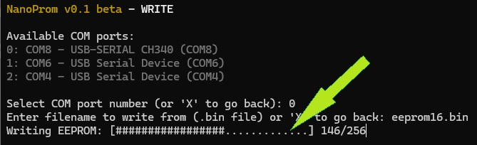

Once the write is complete, NanoProm will inform you whether it was able to write all 256 positions of the EEPROM.

Next, it will ask if you want to verify the file against the flashed EEPROM to ensure they are identical. Hit `Y` and Enter to perform the check. Keep in mind that flashing and serial connections can experience timing issues, so it is **highly recommended to verify**.

### Visual Comparison

The data from the EEPROM (left) and the file you used (right) are displayed on-screen in colors:

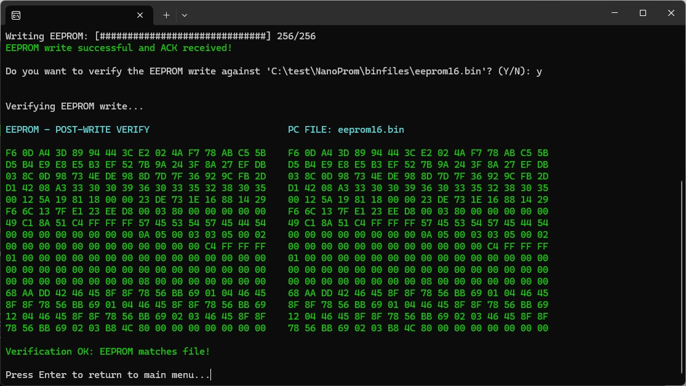

* Green: matches  
* Red: differences found by NanoProm

This picture above shows a 256/256 correct write, while the compare section (further down in this readme) displays a mix of red and green when I deliberately compare two different EEPROMs, illustrating both the color distribution and total number of errors.

NanoProm reads the EEPROM during verification and compares each position, filling the screen with all 256 positions.  

If it encounters an error, it will highlight the differences. While the end section of the EEPROM is not typically used by the Xbox, it is recommended to verify again if a mismatch occurs. If persistent, re-flash the EEPROM and check again.

### Sidenote: Is NanoProm Flawless?

No, it is not. I have gone to great lengths to test, simulate, and reduce problems. This includes carefully timed delays and other tricks to lower the probability of errors. Where errors do occur, NanoProm offers instant rechecks and verifications in the menu so you don’t have to second-guess whether a command was executed incorrectly.

The end result is **higher reliability** than what I previously achieved using a traditional Windows 98 laptop with a 9-pin serial port, where reading and comparing hexadecimal values was done manually - which had been my workflow for almost 25 (!) years.

That said, there is always room for improvement. I am sure someone with more experience in C++, Python, and serial interfaces could further enhance NanoProm. I strongly applaud anyone who wants to try.

## Erasing

In the Erase option, you can choose to fill the EEPROM entirely with `00` or `FF` - both will work. However, in dozens of tests I noticed that `FF` caused no issues, while `00` occasionally ran into timing problems. As a rule of thumb, I personally use `FF`.  

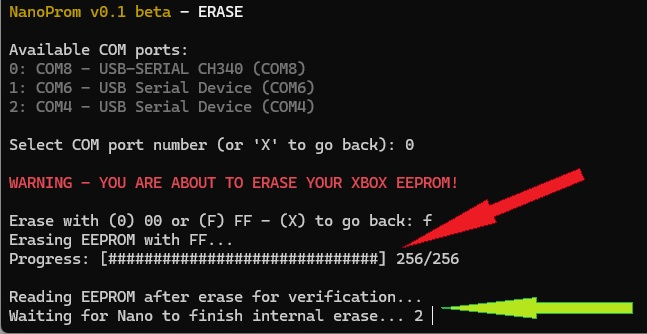  

As shown above, the red arrow points to a progress bar that displays the erasing of data on your EEPROM. The green arrow points to a small time delay I built in, which counts down 3, 2, 1 before continuing. This delay cured most of the timing issues I experienced during testing.  

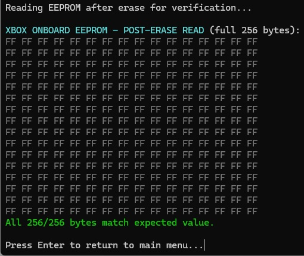  

After this step, the screen will show a new read of your EEPROM and confirm whether the data has been fully flushed with all `FF` (or `00` if you chose that option).

## Comparing EEPROM to a .bin File

In the example below, I am verifying the file `eeprom16.bin` against the current EEPROM (which I have erased with all `FF`s). As expected, the result on screen shows that they do not match.

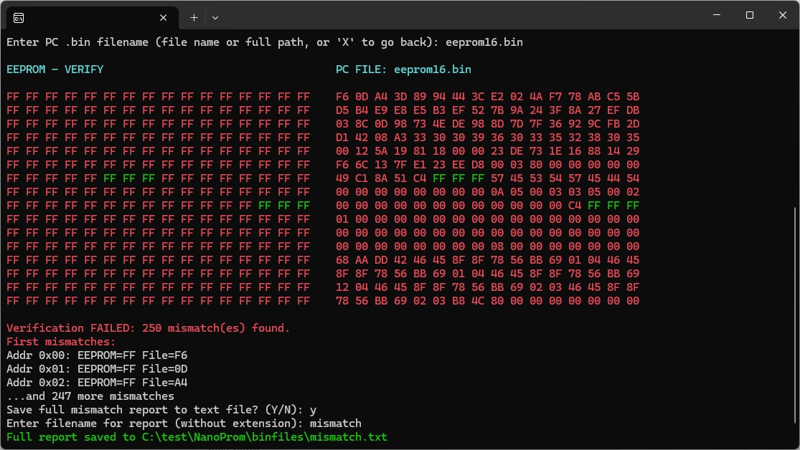

In this case, NanoProm reports 250 of 256 incorrect checks, which is immediately visible on screen as soon as it finds one or more errors.  

Green indicates parts that are identical on both the EEPROM and the file, while red indicates differences.  

Here, my test file `eeprom16.bin` only contains six occurrences of `FF` in total, and you can visually see them on both the EEPROM and the `.bin` file.  

This example is deliberately extreme, showing mostly red, but in other cases you may find the comparison useful, as it is also automatically run after flashing an EEPROM.  

* Zero red is good news  
* In worst-case scenarios, an Xbox may still work with red near the end of the EEPROM  
* You might want to verify which of your `eeprom.bin` backup files matches (or does not match) the one on your Xbox  
* It may indicate a problem with the 24c02 chip if the same positions repeatedly show red  

I have also included an option to save a report containing all memory locations and differences to a `.txt` file (saved in the `binfiles` folder by default). In this example, I named it `mismatch.txt`, and NanoProm will show you exactly where it saved the file.

